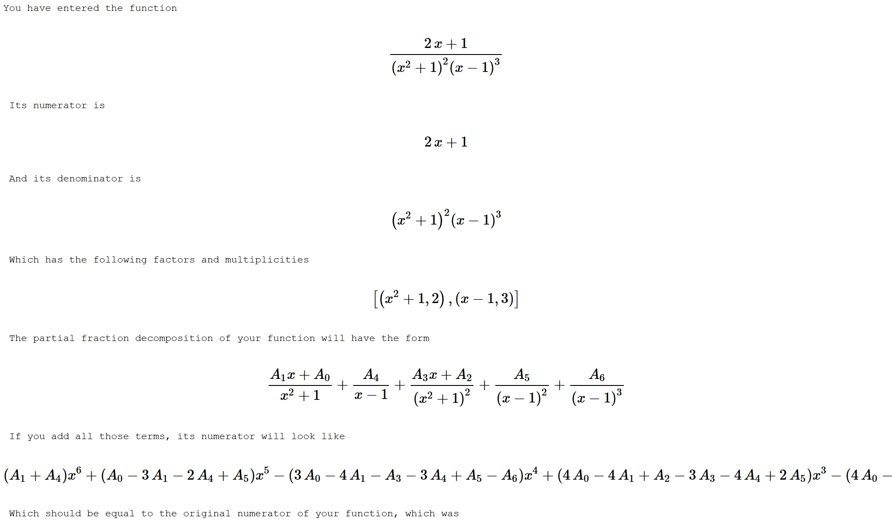
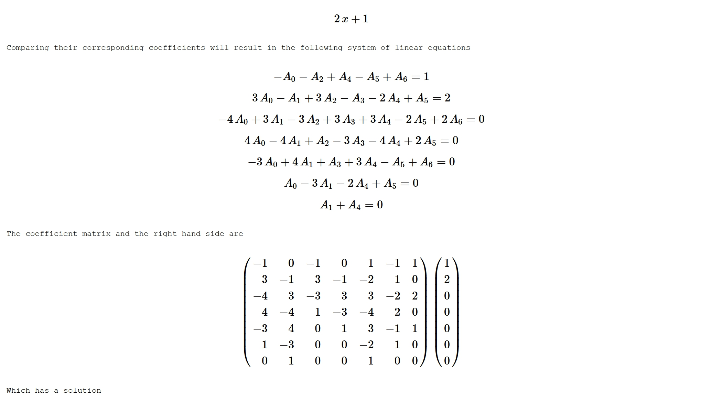
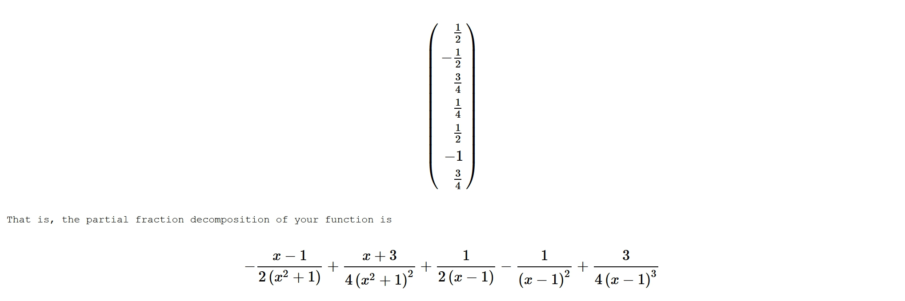
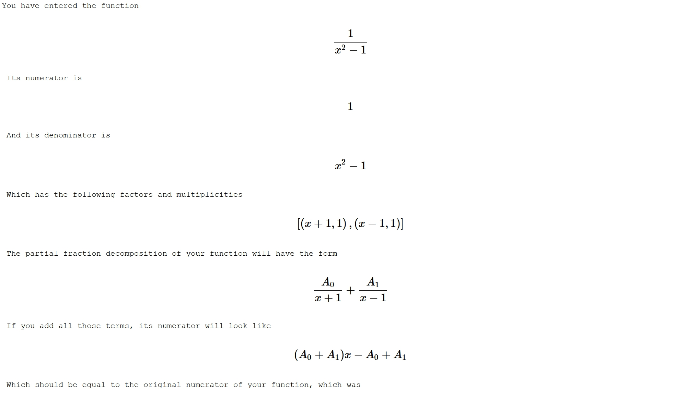
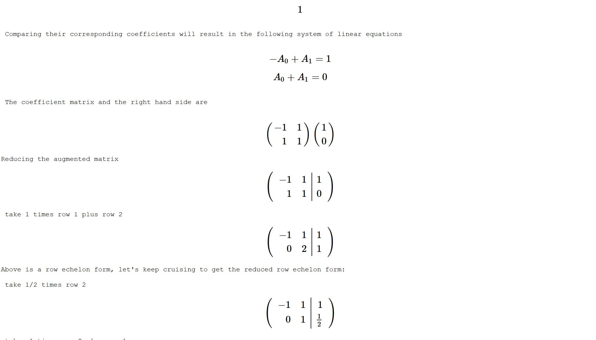
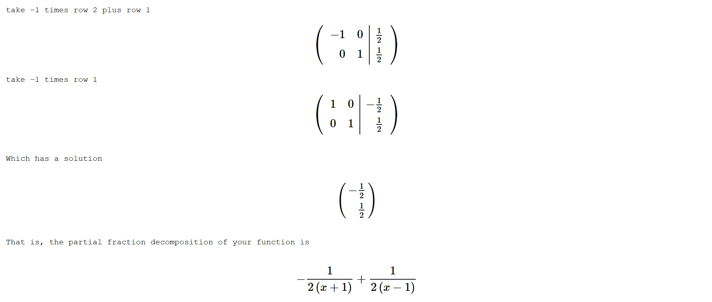

# Step by step partial fraction decomposition

Calculates the partial fraction decomposition of a rational function in a variable x and shows all the steps. You can run by copying the code to the SageCellServer: https://sagecell.sagemath.org (no installation/signup required).

You can call the function with two styles of verbosity. 
- If `steps=False`, then it will just use the built-in pfd function and will show the output.
- Otherwise, it will do all the calculation step-by-step and show meaningful messages for each step. In this case
  - if `linear_steps=False` it will solve the finial system of equations using the solver and it will show/use the output,
  - otherwise, it will create an augmented matrix and reduce it step-by step, and will show meaningful messages for each step. This is not recommended if your system becomes big, as it will become very slow to preview all the steps.

Here is a sample run with the following input:

    num = 2*x + 1
    den = (x-1)^3 * (x^2+1)^2
    f = num/den
    pfd = partial_fraction_decompositioin(f,steps=True,linear_steps=False)
    
And the output is:

Another smaller example with the option `linear_steps=True`:

    num = 1
    den = x^2 - 1
    f = num/den
    pfd = partial_fraction_decompositioin(f,steps=True,linear_steps=True)

And the output is:

